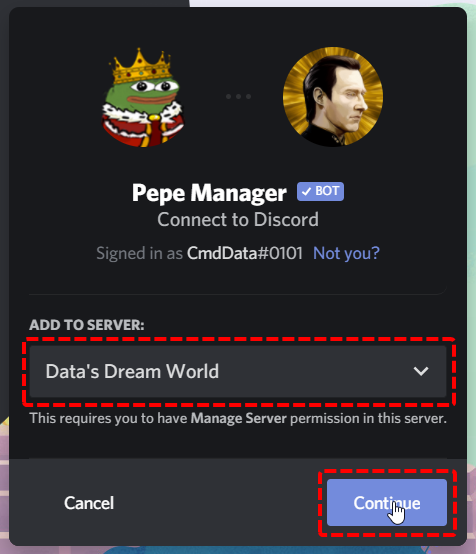
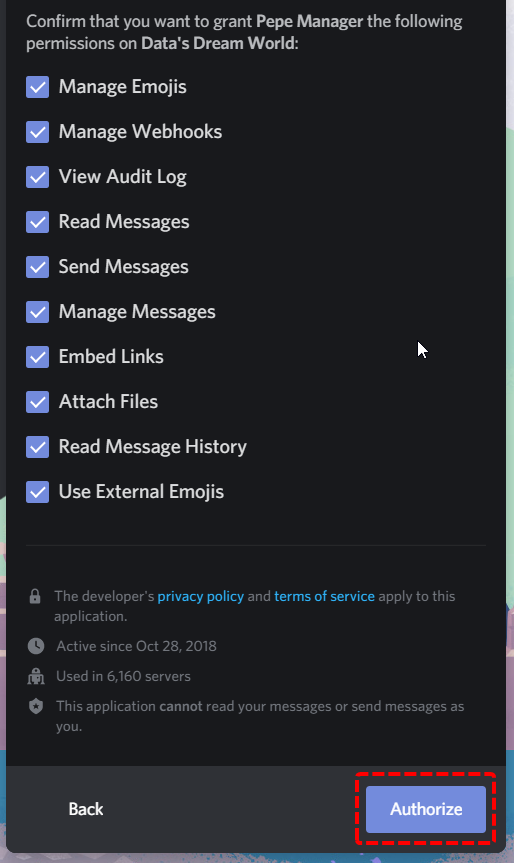

# Getting Started

### Inviting the Bot

To invite Pepe Manager into your Discord server, go to [https://pepemanager.com/invite](https://pepemanager.com/invite). You will see the following page pop up. On the said page, select the server you want to invite Pepe Manager onto.


You need **Manager Server** permission on the server you want to add Pepe Manager to


On the next page you will see an overview of all of the permissions you are about to grant to Pepe Manager by inviting them onto the server. You may remove permissions by clicking on the checkmarks but please only do this if you know what you're doing, some functionalities of the bot may be lost until you re-grant permissions later.  
To confirm, click on Authorize.

You might be prompted to fill out a ReCaptcha survey to confirm that you are not a bot. Complete the Captcha and click on Continue.  
  
**Congratulations, you have added Pepe Manager to your server! Check out these cool guides we've made to get you right into the groove with using Pepe Manager!**

