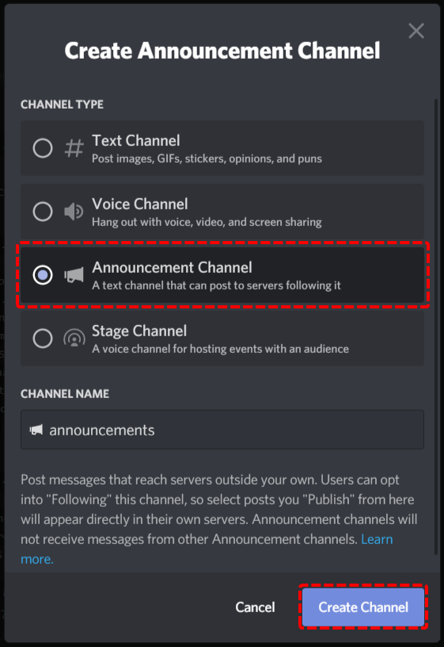
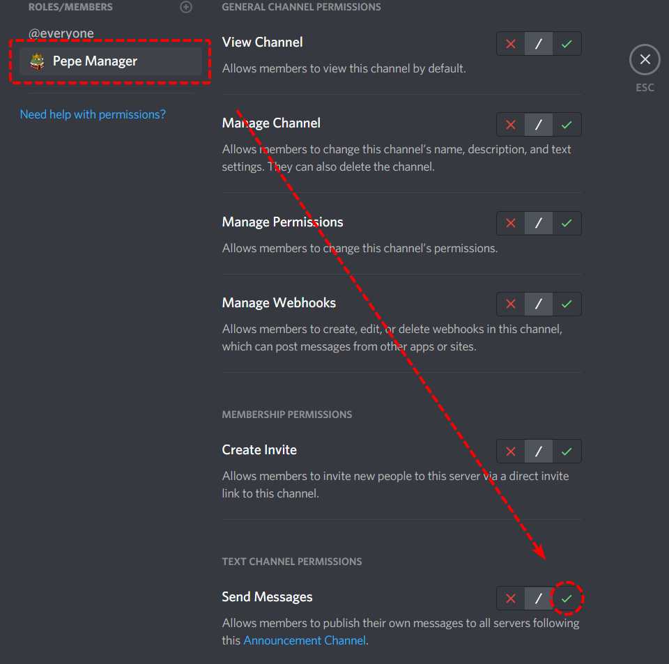

# Automatically Publishing Announcements

### Why Would You Need This?

If you haven't heard of them, [Discord Announcement Channels](https://support.discord.com/hc/en-us/articles/360032008192-Announcement-Channels-) are a super useful addition to any community server to extend their reach to an audience outside of your own server! But in order to do that you need to manually click on a little button to make sure that the announcement actually gets pushed to all of your following servers, and without doubt, have you sometimes just forgotten to click that button!

Well with Pepe Manager you can set it up to make an announcement channel automatically push out any and all announcements you send into the channel! 

### Video Tutorial

If you are averse to long bouts of reading, we have created a video tutorial that should be easy to follow along:



## Guide

### Creating an Announcement Channel

The first step to creating an announcement channel is to enable the community server features, by following this [guide ](https://support.discord.com/hc/en-us/articles/360047132851-Enabling-Your-Community-Server)by Discord themselves!

The next step is to create a new channel, and to select as the channel type: 'Announcement Channel'. Give it an appropriate name and then continue to the next step!



### Giving Pepe Manager Correct Permissions

This next step is quite crucial. By default, Pepe Manager won't be able to announce any messages in the new channel, and therefore you need to grant either Pepe Manager \(The Bot Account\) or Pepe Manager \(The Integration Role\) the **Send Messages** permission in the newly created announcement channel.


Don't worry, the bot will never send any messages on it's own into your announcement channel, it only needs this permission in order to announce messages that have already been sent.




### Configuring the Auto Publisher

Finally, we need to tell Pepe Manager which announcement channel it should automatically publish! By default free servers can set up to 5 separate automatic announcement channels, however, [premium servers](../information/patreon-perks.md) can set up to 25 automatic announcement channels. To get started, type the following command:

Where **&lt; &gt;** implies a required parameter

```text
p!config set autoPublishChannels <Channel/ChannelID/ChannelMention>
```

### Final Words

And that's it! You've successfully created an Automatically Publishing Announcement Channel with Pepe Manager!

If you need any more assistance with Pepe Manager, check out the rest of this documentation or join our support server to talk to an actual human!

