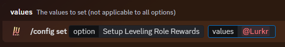
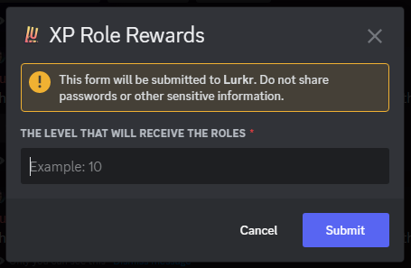
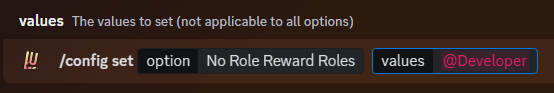
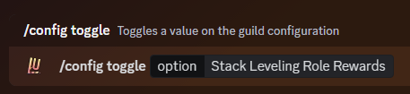

# ✨ Leveling Role Rewards

## Guide

### Adding Leveling Role Rewards

The main meat of Leveling: the role rewards. You can set up roles to be given out to users when they reach a specific Level.

This can be used to simply indicate the users level with a role, give out special colours to users as they gain higher levels, give out permissions that can be earned through activity, and so much more.&#x20;

To get started, enter the command below with the role(s) you want to assign to a specific level in the `values` option.&#x20;

You can enter as many roles as your current server plan will allow. You can check the limits on the Patreon Perks page!


[patreon-perks.md](../information/patreon-perks.md)


<figure><figcaption></figcaption></figure>

You will then receive a modal box asking you to enter the exact Level you want these particular roles to be assigned at.&#x20;

<figure><figcaption></figcaption></figure>

***

### Adding the No Role Reward Roles

This option allows you to set specific roles that will not be awarded other role rewards, even if they reach or surpass the required level.

However you cannot set a specific to be both a role reward **and** a no role reward role.&#x20;

<figure><figcaption></figcaption></figure>

***

### No Leveling Roles

You can now set specific roles to not gain levels, regardless of whether or not the user is in the appropriate leveling channel or not.&#x20;

It is also not important if the user has another role on top or below the role you set to not gain levels.&#x20;

This feature is quite useful if you do not want your staff to gain levels, or to make sure that muted users do not gain levels, etc. To add a role you can type the command below.

You can enter as many roles as your current server plan will allow. You can check the limits on the Patreon Perks page!


[patreon-perks.md](../information/patreon-perks.md)


<figure><figcaption></figcaption></figure>

***

### Adding the Daily Top Leveling Role

You can also reward a user for having the most XP by letting the bot assign a Top Leveling role. This role is given out at 00:00 UTC, and is only ever given to one person on the server. If a user had the Top Leveling role previously, it will be taken off of them.&#x20;


The Top Leveling Role will only be assigned if the qualified person is level 10+. This is done to prevent unfair level gain by other members in the lower levels where gaining levels is easier.


This feature is a quick and easy way to give users a long-term goal to work towards.&#x20;

It also helps if the Top Leveling role is hoisted quite high on the server list, and is given a prominent colour. To set the Top Leveling role, you can type the following command:

<figure><figcaption></figcaption></figure>


It is **highly** suggested that you also set the Top Leveling role as a [No Leveling role](leveling-role-rewards.md#adding-no-leveling-roles) aswell.

Not doing so might lead to the situation that only one person ever receives the Top Leveling role since during their day on the Top they keep gaining levels.

By letting them not gain levels for a day gives other users time to catch up.


***

### Toggling Role Stacking

Now that you've set up some role rewards, you can choose whether or not the bot will stack the roles or not.

Stacking means that each additional role reward will simply be added to the users already existing roles.

Non-Stacking means that any previous role reward roles will be removed when the user gains a new role. This does not affect roles that are not specifically marked as rewards.

By default, stacking is turned **on**.

<figure><figcaption></figcaption></figure>

***

### Final Words 

And that's it! You've successfully learnt about Leveling Role Rewards!

If you need any more assistance with Lurkr, check out the rest of this documentation or join our support server to talk to an actual human!


[troubleshooting.md](../information/troubleshooting.md)

