# 📥 Setting Up Server Leveling

### Why Would You Need This?

Server Leveling is a super easy and effective way to ensure activity and growth in your Discord server. By setting out goals of activity with rewards, users will be enticed to keep the chat going to reach this goal you've put out for them. This goal can be anything from something as simple and inexpensive as a role reward that grants the user a special permission like the ability to send and embed images, to rewarding the topmost active users on your Discord with Nitro!\
Lurkr offers a free and easy-to-use XP and Leveling system so you can keep user retention high, and costs low!

### Video Tutorial

We currently do not have an updated video tutorial for this guide just yet, check back later!

## Guide

### Coming From A Different Bot?

Are you switching to Lurkr from a different leveling bot which you've already used extensively? We understand that resetting your servers leaderboard is something you'd rather never do, and setting up leveling role rewards from scratch is a hassle as well.&#x20;

Why not check out how to automatically import levels from other bots? If the bot you're coming from is supported, Lurkr can pick up where you left off just moments ago!


[importing-levels-from-other-bots.md](importing-levels-from-other-bots.md)


### Toggling Levels

By default, Lurkr will not have leveling enabled. Any user activity that may have occurred before you enabled leveling has not been counted. You need to enable it to get started by typing the following command:

<figure><figcaption></figcaption></figure>

###

### What Messages Count for Leveling?

Any of the following messages can count towards leveling progression, provided the member is not blocked from leveling in some way or another.

* Default text messages
* Reply text messages
* Slash command usages (Any bot, non-ephemeral)
* Context menu command usages (Any bot, non-ephemeral)

###

### Adding Leveling Channels

You can now add specific channels that users can gain XP in. The channels you setup will be by default blacklisted channels, meaning that they are the only ones that are excluded from being able to gain XP.&#x20;

However, as we will explain shortly you can very easily change that within moments. For now, use the /config set command to add as many channels as you want!

You can enter as many channels as your current server plan will allow. You can check the limits on the Patreon Perks page!


[patreon-perks.md](../information/patreon-perks.md)


<figure><figcaption>
You can add up to 30 channels for free, or 50 channels with <a href="../information/patreon-perks.md">Premium</a>!
</figcaption></figure>

Now the bot will send a confirmation message of the information you just entered, however included with that is also a grey button that let's you toggle between the blacklist and the whitelist option whilst still retaining all of the channels you just set! If you therefore want **only** the channels you just entered to be used as leveling channels, press the button that says 'Switch to whitelist'

<figure><figcaption>
If you don't do anything, the channels will be set as they are!
</figcaption></figure>


To simply things and help you understand the different leveling channel modes here is an overview:

**Whitelist** enabled & no leveling channels set = Members **can't** gain levels anywhere

**Blacklist** enabled & no leveling channels set = Members **can** gain levels everywhere



#### And That's It!

If you only want the very basic leveling setup, you are done now! If you want to go more in-depth and learn about many more features that you can use, carry on!\
\
_**ALL STEPS BEYOND THIS POINT ARE OPTIONAL**_


###

### No Leveling Roles

You can now set specific roles to not gain levels, regardless of whether or not the user is in the appropriate leveling channel or not.&#x20;

It is also not important if the user has another role on top or below the role you set to not gain levels.&#x20;

This feature is quite useful if you do not want your staff to gain levels, or to make sure that muted users do not gain levels, etc. To add a role you can type the command below.

You can enter as many roles as your current server plan will allow. You can check the limits on the Patreon Perks page!


[patreon-perks.md](../information/patreon-perks.md)


<figure><figcaption></figcaption></figure>

###

### Adding the Daily Top Leveling Role

You can also reward a user for having the most XP by letting the bot assign a Top Leveling role. This role is given out at 00:00 UTC, and is only ever given to one person on the server. If a user had the Top Leveling role previously, it will be taken off of them.&#x20;


The Top Leveling Role will only be assigned if the qualified person is level 10+. This is done to prevent unfair level gain by other members in the lower levels where gaining levels is easier.


This feature is a quick and easy way to give users a long-term goal to work towards.&#x20;

It also helps if the Top Leveling role is hoisted quite high on the server list, and is given a prominent colour. To set the Top Leveling role, you can type the following command:

<figure><figcaption></figcaption></figure>


It is **highly** suggested that you also set the Top Leveling role as a [No Leveling role](setting-up-server-leveling.md#adding-no-leveling-roles) aswell.

Not doing so might lead to the situation that only one person ever receives the Top Leveling role since during their day on the Top they keep gaining levels.

By letting them not gain levels for a day gives other users time to catch up.


###

### Customizing the Level Up Message

If you find the current Level-Up message to not suit your server style, or you simply want to spice it up a little, you can completely customize it!

We currently only support raw text messages (Not Embeds). To set the Level-Up message you can type the following command:

<figure>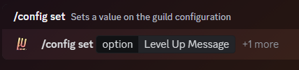<figcaption></figcaption></figure>

This will then open a modal dialog box, in which you can then type and send-off your written out level-up message! When you're done, and are sure that the message is within the 1,000 character limit, click on the submit button!

<figure>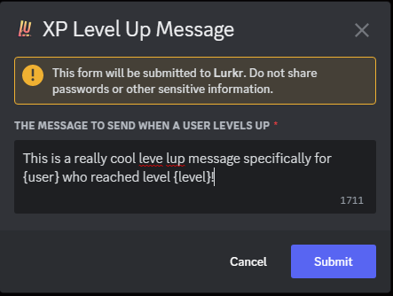<figcaption></figcaption></figure>

There are several **tags** you can include in your Level-Up message. These parameters will be replaced with the appropriate information when the Level-Up message is sent.\
\
_You must include the {} brackets in your message for the tags to show up!_

| Information                    | Parameter            |
| ------------------------------ | -------------------- |
| User Mention (@User)           | {user}               |
| User Tag (User#1234)           | {user.tag}           |
| Username (User)                | {user.username}      |
| User Discriminator (1234)      | {user.discriminator} |
| User ID (99787644430475264)    | {user.id}            |
| Server Name (My Cool Server)   | {guild.name}         |
| Server ID (493351982887862283) | {guild.id}           |
| Level Reached (5)              | {level}              |

###

### Setting the Level Up Message Destination

By default Lurkr will simply send the Level-Up message in the same channel where the user who Leveled-Up last spoke in, but this can sometimes be intrusive and can disrupt normal conversation.

Not to worry though, as you can set where Lurkr will send the Level-Up message. To set this up, simply type the following command:

<figure>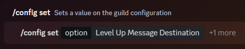<figcaption></figcaption></figure>

The command will reply with a select menu, asking you to select where to send the level up announcement to.

Unless you are selecting a custom channel, simply select an option from the drop-down menu.

<figure>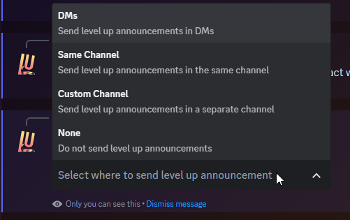<figcaption></figcaption></figure>

If you are selecting a custom channel, you must choose the optional slash command option `values` and in the option field enter the custom channel you want to use.

###

### When to send the Level Up Message

By default, Lurkr will send the Level-Up message after every level increase no matter what. However, you can also configure the bot to send the message at different times and for different reasons/levels.&#x20;

This first command lets you set exactly which levels should be announced and which shouldn't. You can include as many levels as you want, within reason.

Only these levels will then be announced, regardless of where the level-up message will be sent.

<figure>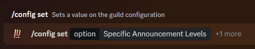<figcaption></figcaption></figure>

The next command lets you set from what level on-wards you want the levels to be announced.

This means that any and all levels below this threshold won't be announced, but all of them including the minimum level will be announced.

<figure>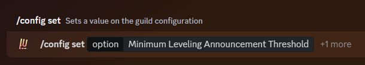<figcaption></figcaption></figure>

The next command lets you set if you want levels to only be announced if they are a part of a multiple of a specific number.

For example if you only want to announce the levels `5`, `10`, `15` and so on, you would set this command to a multiple of 5.

<figure>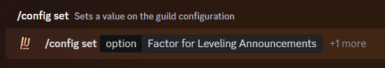<figcaption></figcaption></figure>

Lastly, you can also additionally toggle whether or not you want to announce **only** the levels that also have a Leveling Role attached to them.

<figure>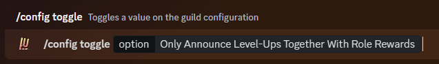<figcaption></figcaption></figure>

The following table shows you the hierarchy of all of these settings and when they go into effect if you've set multiple of them. Please refer to this when you're troubleshooting why a certain level isn't being announced.

| Level Announcement Setting | Hierarchy of Announcement |
| -------------------------- | ------------------------- |
| Minimum Level              | 1                         |
| Manually Set Levels        | 2                         |
| Only Leveling Roles        | 3                         |
| Multiple (Factor) Of       | 4                         |


By this table, if you have manually set levels **1**, **2** & **3** to have an announcement, but also set a **multiple of 5**, the only level that would be left out with be **level 4**.


###

### Adding Leveling Role Rewards

The main meat of Leveling: the role rewards. You can set up roles to be given out to users when they reach a specific Level.

This can be used to simply indicate the users level with a role, give out special colours to users as they gain higher levels, give out permissions that can be earned through activity, and so much more.&#x20;

To get started, enter the command below with the role(s) you want to assign to a specific level in the `values` option.&#x20;

You can enter as many roles as your current server plan will allow. You can check the limits on the Patreon Perks page!


[patreon-perks.md](../information/patreon-perks.md)


<figure><figcaption></figcaption></figure>

You will then receive a modal box asking you to enter the exact Level you want these particular roles to be assigned at.&#x20;

<figure><figcaption></figcaption></figure>

###

### Adding the No Role Reward Roles

This option allows you to set specific roles that will not be awarded other role rewards, even if they reach or surpass the required level.

However you cannot set a specific to be both a role reward **and** a no role reward role.&#x20;

<figure><figcaption></figcaption></figure>

###

### Automatically Resetting Levels

Automatically resetting levels can be very useful to keep your server nice and organized, and to punish those you ban even more!

When the condition you set has been met, Lurkr will automatically delete the affected users level data (If they had any) without questions.&#x20;

**Kicking a user has the same effect as leaving though, so be careful!**

<figure>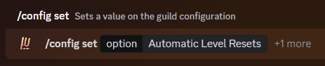<figcaption></figcaption></figure>

You will then receive a drop-down menu from which you can choose what you want the bot to do. You can only choose one at a time.

| **What Will Trigger the Reset?**                    | **Response Type** |
| --------------------------------------------------- | ----------------- |
| Nothing                                             | None              |
| When the user leaves the server for whatever reason | Leave/Kick        |
| When the user is banned for whatever reason         | Ban               |
| When the user leaves or when the user is banned     | Both              |

###

### Ignored Bot Prefixes

You are obviously using more than one bot in your server, and many times users can use bot commands in channels where you might also want to have leveling enabled.

With Lurkr you can choose whether or not the bot ignores commands, even if they should be counted as a normal leveling message.

For example if someone uses the command `?hug <User>` and you have the prefix `?` blacklisted, that message won't be counted as a leveling message.

You can enter as many prefixes as your current server plan will allow. You can check the limits on the Patreon Perks page!


[patreon-perks.md](../information/patreon-perks.md)


<figure>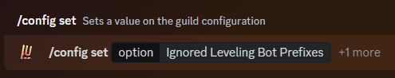<figcaption></figcaption></figure>

You will then receive a modal box in which you can enter the message command prefixes you want to be blocked, separated by a comma.

<figure><figcaption></figcaption></figure>

###

### Server-Wide Rank Card Colour

Normally, every user can choose their own rank card colour accent. As a server owner, **if they haven't set one themselves**, you can set one for them to provide a cohesive appearance for the entire server whenever everyone is checking out their rank cards!

<figure>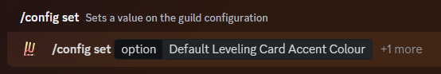<figcaption></figcaption></figure>

You will then receive a modal box asking you which option for the accent colour to choose. You can only choose one option at a time.&#x20;

Below the example image is a table of all of the different choices and what they will do.

<figure>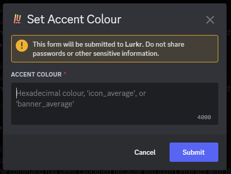<figcaption></figcaption></figure>

| Accent Colour                    |                                                 Description |
| -------------------------------- | ----------------------------------------------------------: |
| Hexadecimal Colour (Eg. #ff7077) |              Sets the colour to your custom hex colour code |
| Icon Average                     |   Sets the colour to the average colour of your server icon |
| Banner Average                   | Sets the colour to the average colour of your server banner |

###

### Toggling Role Stacking

Now that you've set up some role rewards, you can choose whether or not the bot will stack the roles or not.

Stacking means that each additional role reward will simply be added to the users already existing roles.

Non-Stacking means that any previous role reward roles will be removed when the user gains a new role. This does not affect roles that are not specifically marked as rewards.

By default, stacking is turned **on**.

<figure><figcaption></figcaption></figure>

###

### Toggling Leveling in Threads

Lurkr can see every message in every thread, and enabling this can mean a lot more diversity and a lot less clutter for different topics in your server, and yet still allowing you to reward active chatters with levels.&#x20;

By default, leveling in threads is turned **off**.

<figure>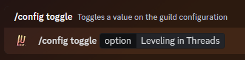<figcaption></figcaption></figure>


Toggling this **will not** enable levels on all threads, it will enable level gain on threads that are part of already enabled XP channels.&#x20;


###

### Final Words

It's really easy to set up an activity tracking system, but as you want to add more and more features, and reward your users for the loyalty and activity it becomes more and more complex. If you are new to bots don't be scared of all of the complicated commands and command structures, new words that bots use to describe what they're doing, etc.\
\
If you need any more assistance with Lurkr, check out the rest of this documentation or join our support server to talk to an actual human!



##

## Troubleshooting


**We've Automated Troubleshooting (Almost)**

With our new [/config troubleshoot](../config-commands/config/troubleshoot.md) command you can quickly check the most common issues with your setup!&#x20;


### Leveling Roles aren't being Assigned!

If you think you have set up the Leveling roles correctly, but users aren't getting them when they level up or when they use the `/syncrolerewards` command, follow these steps in order to fix your issue! These steps are also the same when troubleshooting the Top Leveling role.

#### 1. Make sure the bot has 'Manage roles' permission

The bot needs to have this permission in order to assign roles. If you're new to Discord, a lot of different permissions are bundled under one permission umbrella, and giving the manage roles permission also grants users access to assign roles.

#### 2. Make sure the roles you want to assign are below the bot on the role list

Another common issue is that the bot **DOES** have the manage roles permission, but the highest bot role (ie. The top-most role that the bot is assigned to) is lower down in the role-ranking than the roles you want it to assign. Hierarchy moves from the top to the bottom, so make sure that the bot always has a role that's above the Leveling roles.

#### 3. Make sure the roles you want to assign aren't integration managed

Integration managed means that the role you want to assign is being used by an external bot or integration. [This](https://i.imgur.com/EkIylx6.png) is what you will see at the top of the role edit page when the role is managed by an integration.

#### 4. It's still not working!

If the bot still isn't assigning the Leveling roles, join our support server and create a post in our support forum channel. Make sure to include all of your troubleshooting steps and screenshots!


