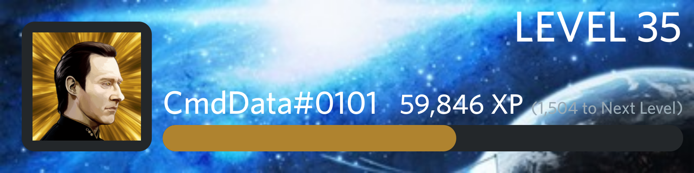

# Hintergrund

### Beschreibung

Mit diesem Befehl können Sie den Hintergrund Ihrer Leveling-Karte für den gesamten Bot ändern. Diese Funktion ist völlig kostenlos und kann sowohl auf kostenlosen Servern als auch auf Premium-Servern für alle Benutzer verwendet werden.  
  
Wenn Sie einen benutzerdefinierten Hintergrund einstellen, wird der Standardhintergrund "Welliges Grau" durch das von Ihnen ausgewählte Bild ersetzt. Die Farbe des Textes bleibt gleich, und das dunkelgraue, abgerundete Quadrat um Ihr Profilbild bleibt ebenfalls gleich.  
Die Farbe des Fortschrittsbalkens wird von der [Durchschnittsfarbe](https://matkl.github.io/average-color/) Ihres Profilbildes bestimmt. Ziehen Sie in Erwägung, Ihr Profilbild zu ändern, wenn Ihr eingestellter Hintergrund mit der Farbe des Fortschrittsbalkens kollidiert.




### Befehlsstruktur

Wobei **&lt; &gt;** einen erforderlichen Parameter impliziert

```text
p!background <Method>
```

| Methode | Beschreibung |
| :--- | :--- |
| [delete](delete.md) | Löscht Ihren Hintergrund, falls dieser eingestellt ist |
| [set](set.md) | Setzt einen neuen Hintergrund oder ersetzt, wenn bereits einer gesetzt ist |
| [view](view.md) | Zeigt Ihren Hintergrund an, wenn er eingestellt ist |

### Aliase

* `background`
* `level_background`
* `leveling_background`

