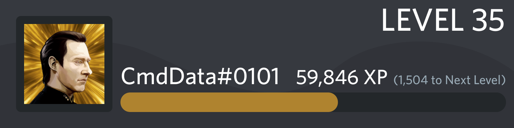
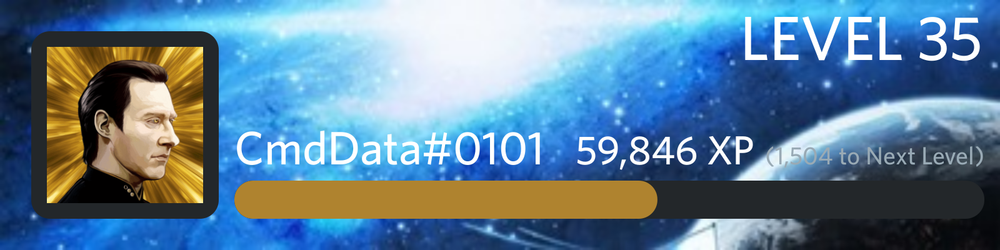

# Background

### Description

This command can be used to change your leveling card background for the entire bot. This feature is completely free, and can be used on both free servers and premium servers for all users.\
\
Setting a custom background will replace the default 'Wavy Grey' background with the image you selected. The colour of the texts will remain the same, and the dark grey rounded square around your profile picture will also remain the same. \
The colour of the progress bar is determined by the [average colour](https://matkl.github.io/average-color/) of your profile picture, consider changing your profile picture if your set background clashes with the colour of the progress bar.





### Command Structure

Where **< >** implies a required parameter

```
p!background <Method>
```

| Method              | Description                                             |
| ------------------- | ------------------------------------------------------- |
| [delete](delete.md) | Deletes your background if its set                      |
| [set](set.md)       | Sets a new background or replaces if one is already set |
| [view](view.md)     | Shows your background if its set                        |

### Aliases

* `background`
* `level_background`
* `leveling_background`
