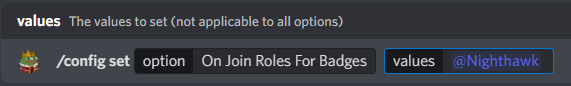

# Sync Role Rewards

### Description

This command can be used to synchronize the role rewards that you currently have to the ones you should have. This can happen when new role rewards have been added that you have already surpassed, such as if a level 10 role reward has been added, and you're already level 20. By default, Pepe Manager will synchronize your roles every time you level up, however with this command you can do it manually.

### Command Structure

Command Options:\
`member` • Can be used by moderations to synchronize other users.

<figure><figcaption></figcaption></figure>

### **Permission**

* N/A **(User)**
* `Manage Roles` **(Bot)**
